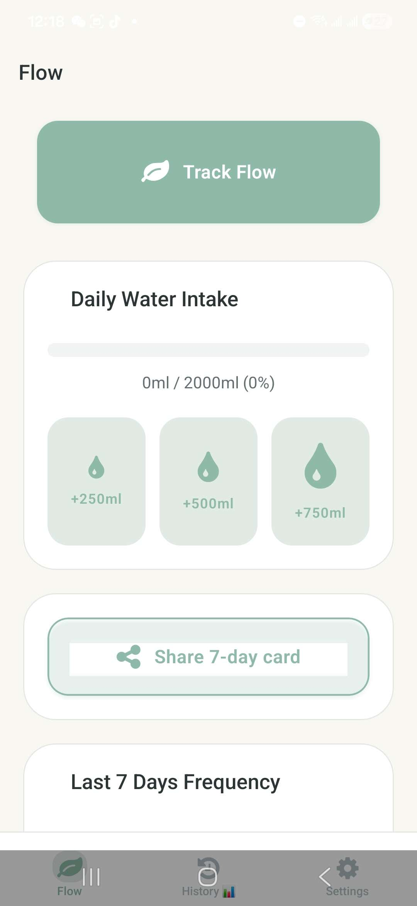
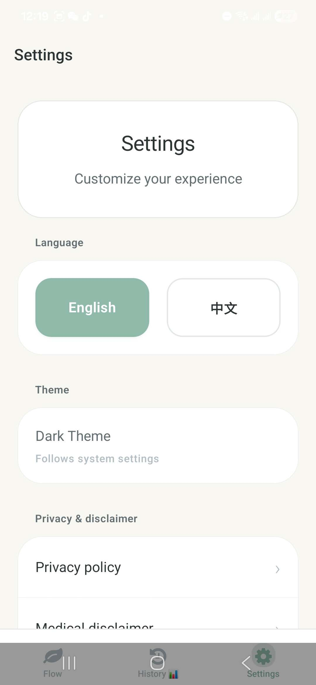

# Flow / La-le-mo

A local-first personal pattern tracker for bowel habits, hydration, and wellness notes.

Flow is designed for private day-to-day reflection, not diagnosis. It helps a person save quick entries, notice comfort and regularity patterns over time, and export their own data when they want a backup or a shareable summary.

---

## Product Problem

Digestive and hydration patterns are easy to forget, awkward to discuss, and often too personal for cloud-first products. Flow explores how a sensitive wellness tracker can feel calm, fast, and trustworthy without pretending to provide medical answers.

---

## Target Users

- People who want a private log of bowel movements and hydration.
- People trying to notice personal routine patterns around comfort, timing, water, food notes, or movement.
- People who want exportable records for their own reflection or for a conversation with a professional.

---

## Core Flows

- **Quick log**: save a bowel habit entry with a comfort level in a few taps.
- **Detailed entry**: add optional notes, food tags, and movement context.
- **Hydration tracking**: quickly log common water amounts and set gentle reminders.
- **History**: review weekly, monthly, and yearly patterns.
- **Pattern summaries**: view simple summaries based only on saved entries.
- **Export and sharing**: export CSV/JSON data or create an optional 7-day summary card.

---

## Privacy-First Design Decisions

- Records are stored on device using local storage.
- There is no Flow account or sync server in this project.
- Export and sharing are explicit user actions.
- Privacy and non-medical disclaimer screens are available in Settings.
- Clearing app data or uninstalling may delete local records, so export is available for backup.

---

## Non-Medical Disclaimer

Flow is a personal tracking and reflection tool. It is not a medical device and does not diagnose, treat, or prevent disease. Pattern summaries are based only on saved entries and should not be treated as medical advice. If symptoms or concerns come up, users should consider speaking with a qualified healthcare professional.

---

## Demo / Download

### Android APK

The Android APK is available through the **Releases** section of this repository.

[Download APK from Releases](https://github.com/9OwO6/flow/releases)

> Android may require allowing installation from unknown sources before installing the APK manually.

---

## Showcase

### Home & Daily Tracking

<table>
  <tr>
    <td align="center" width="50%">
      
      <br />
      <b>Home & Daily Status</b>
      <br />
      Quick access to daily logging, hydration, and recent pattern status.
    </td>
    <td align="center" width="50%">
      
      <br />
      <b>Daily Overview</b>
      <br />
      A calm snapshot of saved entries, hydration, and recent activity.
    </td>
  </tr>
</table>

### Pattern Summaries & Insights

<table>
  <tr>
    <td align="center" width="50%">
      
      <br />
      <b>Weekly Pattern Summary</b>
      <br />
      Personal pattern reflection based only on saved entries.
    </td>
    <td align="center" width="50%">
      
      <br />
      <b>Pattern Notes</b>
      <br />
      Gentle, non-diagnostic notes for personal reflection.
    </td>
  </tr>
</table>

### History & Settings

<table>
  <tr>
    <td align="center" width="50%">
      
      <br />
      <b>Weekly History</b>
      <br />
      Review recent entries and saved patterns.
    </td>
    <td align="center" width="50%">
      
      <br />
      <b>Yearly View</b>
      <br />
      View longer-term monthly patterns and frequency summaries.
    </td>
  </tr>
  <tr>
    <td align="center" width="50%">
      
      <br />
      <b>Settings</b>
      <br />
      Language, reminders, feedback, and privacy-related controls.
    </td>
    <td align="center" width="50%">
      
      <br />
      <b>Trust & Data</b>
      <br />
      Export records as CSV / JSON and manage local app data.
    </td>
  </tr>
</table>

---

## Portfolio Highlights

- Sensitive-topic product framing with careful, non-diagnostic language.
- Local-first trust model for private wellness data.
- Fast daily logging loop with optional richer context.
- Pattern summaries and export flows without cloud dependency.
- Bilingual UI foundation with English and Chinese resources.
- Expo / React Native implementation with a reusable design-token layer.
- Iterative product polish from prototype-style interactions to calmer V2 mobile UX.

---

## Key Features

### Record Tracking

- Log daily bowel movement records.
- Track comfort level and timing.
- Add optional notes, food tags, and movement context.
- Search and review historical records.
- Organize records by week, month, and year.

### Pattern Summaries

- Weekly and monthly pattern summaries.
- Regularity and comfort trend reflection.
- Distribution summaries based only on saved entries.
- Empty states that avoid unsupported scoring when there is not enough data.
- Non-diagnostic wording for privacy-sensitive personal tracking.

### Hydration Tracking

- Daily water intake goal.
- Quick add buttons for common water amounts.
- Visual progress tracking.
- Gentle hydration reminder settings.

### Settings & Data Controls

- English / Chinese language option.
- Hydration reminders and quiet hours.
- Haptics, motion feedback, celebration settings, and custom success sounds.
- CSV / JSON export.
- Clear local data.
- Privacy and non-medical disclaimer screens.

---

## Tech Stack

- Expo SDK 54
- React Native 0.81
- React 19
- TypeScript
- Expo Router
- React Native Paper
- i18next / react-i18next
- AsyncStorage
- Expo Notifications
- Expo File System
- Expo Sharing
- Expo AV
- Expo Document Picker

---

## Getting Started

```bash
npm install
npm run start
```

### Common Scripts

| Command | Description |
| --- | --- |
| `npm run start` | Start Expo dev tools |
| `npm run start:go` | Start for Expo Go |
| `npm run android` | Run Android development build |
| `npm run ios` | Run iOS development build |
| `npm run web` | Run web preview |
| `npm test` | Jest watch mode |

### Build Notes

Native permission changes, such as microphone access for custom success sounds, require a new native build. EAS configuration is present in `app.json` / `eas.json`; signing assets should remain local and gitignored.

---

## Documentation

- **Build Notes**: Android APK build and release workflow.
- **Design Notes**: product positioning, brand direction, and UI principles.
- **Troubleshooting Notes**: Expo Go and EAS build troubleshooting.

These notes can live in dedicated documentation files as the project grows. The README keeps the public portfolio narrative concise.

---

## Product Goals

Flow was built to practice mobile product thinking through a privacy-sensitive personal tracking use case.

The main goals were to:

- Design a simple and calm mobile interface.
- Turn daily records into useful personal summaries.
- Build a multi-screen mobile app experience.
- Support local-first data handling.
- Add practical settings, reminders, and export features.
- Make the app useful beyond a basic CRUD demo.

---

## Future Improvements

Planned or possible improvements:

- Better chart visualizations.
- Improved accessibility and contrast.
- Stronger bilingual copy polish.
- Encrypted local data storage.
- Backup / restore support.
- iOS TestFlight build.
- Smoother onboarding flow.
- Additional manual QA on real devices.

---

## Project Status

Current status: V2 portfolio showcase.

The app has core tracking, pattern summaries, history views, settings, and data-management functionality. It is suitable as a mobile product showcase and may continue to evolve with additional polish.

---

## Author

Leo Wang  
CS graduate based in Richmond, BC, Canada.

- GitHub: [9OwO6](https://github.com/9OwO6)
- LinkedIn: Yanghuijing Wang

---

## License

This project is currently maintained as a personal portfolio project.

License information can be updated later if the project is prepared for public reuse.
