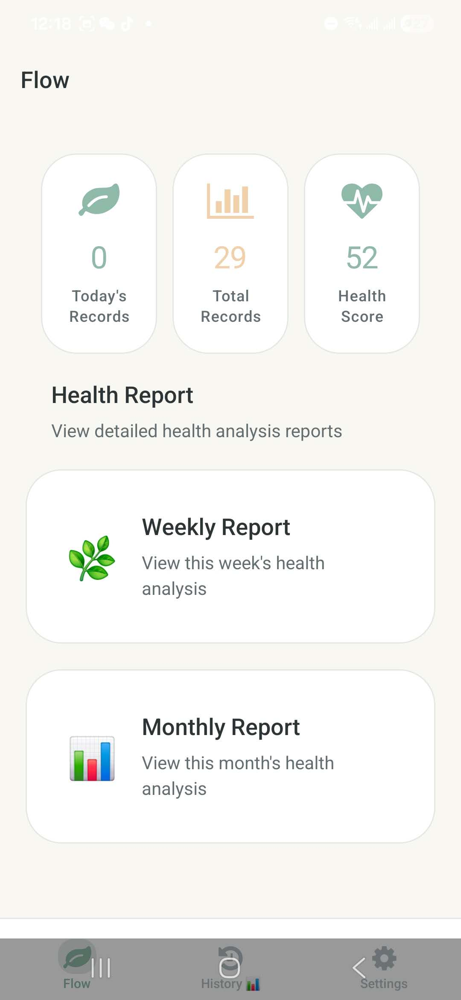
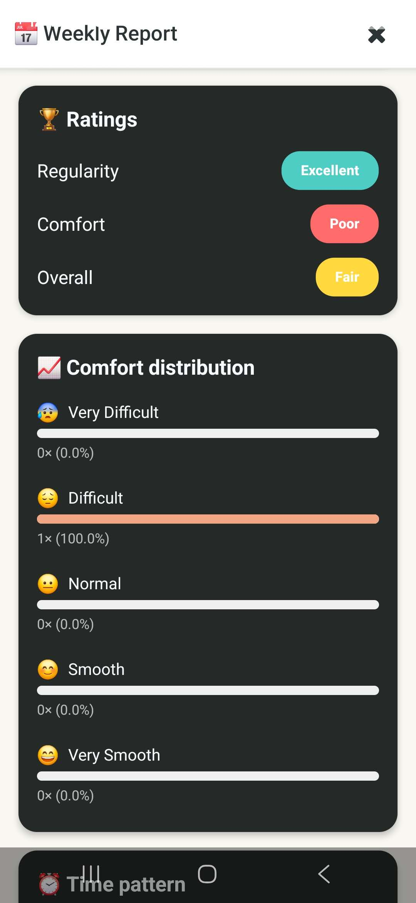
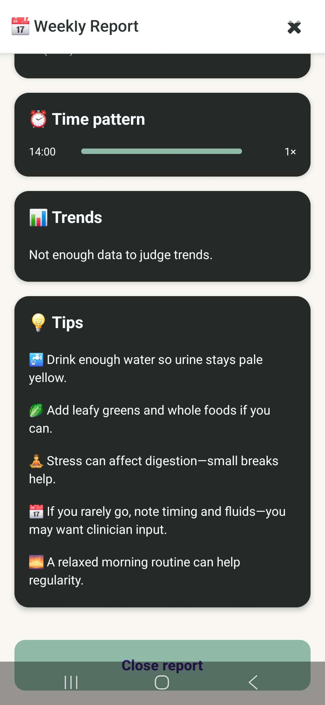
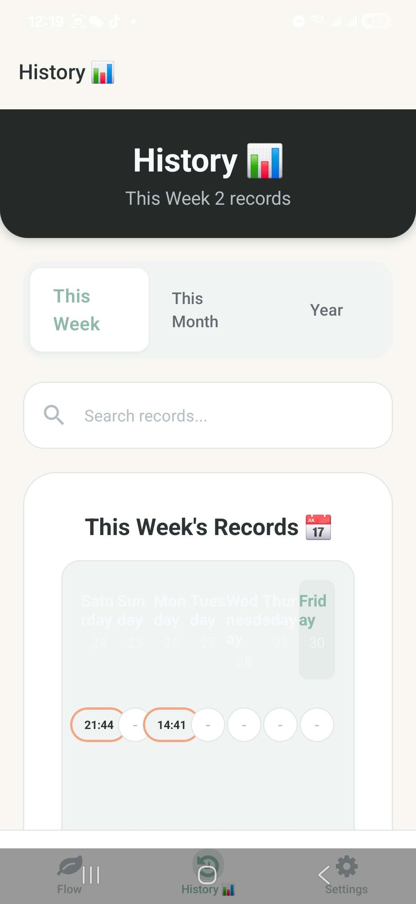
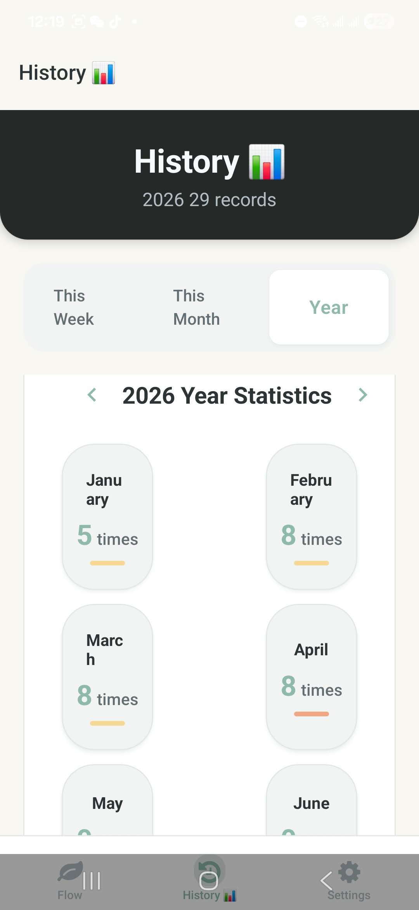
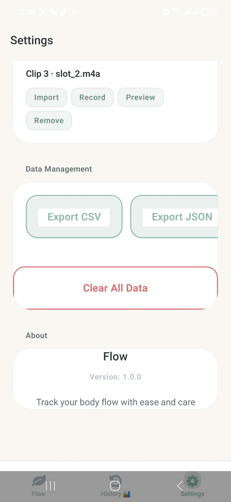

# Flow

A privacy-conscious mobile health tracking app for logging bowel patterns, hydration, symptoms, and wellness trends with weekly and monthly reports.

Flow is designed as a practical mobile app that helps users turn simple daily records into meaningful health patterns. The app focuses on fast logging, local-first data handling, wellness summaries, hydration reminders, and exportable records.

> **Note:** This project is for personal health tracking and portfolio demonstration. It is not a medical diagnosis tool.

---

## Overview

Flow helps users track body flow patterns in a simple, private, and structured way.

The app supports:

- quick daily record logging
- hydration tracking
- weekly and monthly reports
- health score summaries
- comfort and regularity analysis
- time-pattern review
- wellness tips
- data export
- reminder settings
- bilingual interface support

The goal of this project was to build a complete mobile product experience rather than a single-screen demo.

---

## Demo / Download

### Android APK

The Android APK is available through the **Releases** section of this repository.

[Download APK from Releases](https://github.com/9OwO6/flow/releases)

> Android may require allowing installation from unknown sources before installing the APK manually.

---

## Showcase

### Home & Daily Tracking

<table>
  <tr>
    <td align="center" width="50%">
      
       
      <b>Home & Hydration</b>
       
      Quick access to daily tracking, water intake, and recent frequency.
    </td>
    <td align="center" width="50%">
      
       
      <b>Health Dashboard</b>
       
      Overview of today's records, total records, and health score.
    </td>
  </tr>
</table>

### Reports & Insights

<table>
  <tr>
    <td align="center" width="50%">
      
       
      <b>Weekly Report</b>
       
      Health score, summary metrics, and comfort-based ratings.
    </td>
    <td align="center" width="50%">
      
       
      <b>Trends & Tips</b>
       
      Time pattern analysis, trend notes, and practical wellness tips.
    </td>
  </tr>
</table>

### History & Settings

<table>
  <tr>
    <td align="center" width="50%">
      
       
      <b>Weekly History</b>
       
      Review weekly records and search previous logs.
    </td>
    <td align="center" width="50%">
      
       
      <b>Yearly Statistics</b>
       
      View long-term monthly patterns and frequency summaries.
    </td>
  </tr>
  <tr>
    <td align="center" width="50%">
      
       
      <b>Settings</b>
       
      Language, theme, reminders, quiet hours, and feedback settings.
    </td>
    <td align="center" width="50%">
      
       
      <b>Data Management</b>
       
      Export records as CSV / JSON and manage local app data.
    </td>
  </tr>
</table>

---

## Key Features

### Record Tracking

- Log daily bowel movement records
- Track comfort level and timing
- Review recent frequency
- Search historical records
- Organize records by week, month, and year

### Health Reports

- Weekly report summary
- Monthly health analysis
- Health score overview
- Regularity rating
- Comfort distribution
- Time pattern analysis
- Simple wellness tips based on recorded data

### Hydration Tracking

- Daily water intake goal
- Quick add buttons for common water amounts
- Visual progress tracking
- Hydration reminder settings

### Settings & Personalization

- English / Chinese language option
- System-based theme behavior
- Hydration reminders
- Quiet hours
- Haptics and motion feedback
- Success sound settings

### Data Management

- Export data as CSV
- Export data as JSON
- Clear local data
- Local-first privacy mindset

---

## Tech Stack

- **Framework:** React Native / Expo
- **Language:** TypeScript
- **Navigation:** Expo Router / React Navigation
- **Storage:** Local device storage
- **Notifications:** Reminder and quiet-hour logic
- **UI:** Mobile-first custom UI components
- **Platform:** Android APK build

> Tech stack may be updated as the project evolves.

---

## Documentation

- [Build Notes](./docs/build.md) — Android APK build and release workflow
- [Design Notes](./docs/design.md) — product positioning, brand direction, and UI principles
- [Troubleshooting Notes](./docs/troubleshooting.md) — Expo Go and EAS build troubleshooting

---

## Product Goals

Flow was built to practice mobile product thinking through a real-world personal health tracking use case.

The main goals were:

- design a simple and calm mobile interface
- turn raw daily records into useful summaries
- build a multi-screen mobile app experience
- support local-first health data handling
- add practical settings, reminders, and export features
- make the app useful beyond a basic CRUD demo

---

## UX / UI Direction

The interface uses a soft, calm, health-oriented visual style.

Design priorities:

- large readable text
- rounded cards
- low-friction daily input
- soft green accent color
- clear report sections
- simple navigation
- mobile-friendly spacing
- gentle feedback instead of overwhelming charts

The app intentionally avoids a clinical or overly complex medical interface. The goal is to make private health tracking feel approachable and manageable.

---

## Privacy & Disclaimer

Flow is designed with a privacy-first mindset.

Health-related records should remain user-controlled. The project emphasizes:

- local-first data handling
- transparent export options
- no unnecessary account system
- no public sharing by default

This app is not intended to diagnose, treat, or replace professional medical advice. If users experience persistent discomfort, pain, unusual symptoms, or major changes in bowel habits, they should consult a qualified healthcare professional.

---

## What I Learned

Through this project, I practiced:

- mobile app structure and navigation
- user-centered health tracking workflows
- data summary and report design
- local data management
- settings and reminder UX
- building a complete app experience from idea to APK
- balancing sensitive health-related content with respectful product design

---

## Future Improvements

Planned or possible improvements:

- better chart visualizations
- improved accessibility and contrast
- more detailed trend analysis
- customizable health goals
- stronger bilingual copy polish
- encrypted local data storage
- backup / restore support
- iOS TestFlight build
- smoother onboarding flow

---

## Project Status

Current status: **MVP / portfolio showcase**

The app has core tracking, reporting, settings, and data-management functionality. It is suitable as a mobile product showcase and may continue to evolve with additional polish.

---

## Author

**Leo Wang**  
CS graduate based in Richmond, BC, Canada.

- GitHub: [9OwO6](https://github.com/9OwO6)
- LinkedIn: [Yanghuijing Wang](https://www.linkedin.com/in/yanghuijing-wang-01459b291/)

---

## License

This project is currently maintained as a personal portfolio project.  
License information can be updated later if the project is prepared for public reuse.
